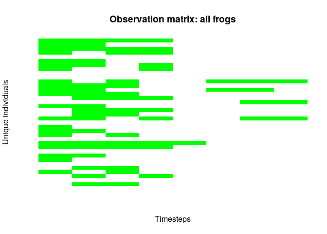
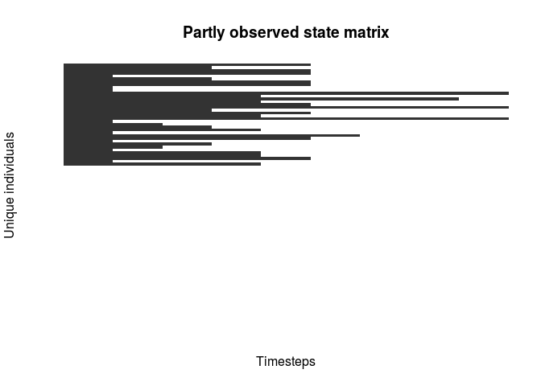

mrmr: mark recapture miscellany in R :frog:
===========================================

[](https://travis-ci.org/SNARL1/mrmr)

This package automates common data processing steps for mark recapture data, with an emphasis on data collected by folks at the Sierra Nevada Aquatic Research Lab (SNARL). It makes some very specific assumptions about the structure of the data in order to construct observation and occurrence matrices. This package is intended to be used along with something like [JAGS](http://mcmc-jags.sourceforge.net/) to fit hierarchical Bayesian mark recapture models.

(Not to be confused with the greatest musical group of the 20th century, Mister Mister)


Installation
------------

``` r
devtools::install_github("mbjoseph/mrmr")
```

Usage
-----

``` r
library(mrmr)
mr_data <- load_mr("tests/testthat/ex.xlsx")
mr_data
#> $surveys
#> # A tibble: 77 x 16
#>    basin   site_id capture_date survey_year period_id pit_tag_id     
#>    <chr>     <dbl> <date>             <dbl> <chr>     <chr>          
#>  1 Bedrock   12345 2008-07-24          2008 1.1.1     985121011993027
#>  2 Bedrock   12345 2008-07-24          2008 1.1.1     985121012022903
#>  3 Bedrock   12345 2008-07-24          2008 1.1.1     985121012023064
#>  4 Bedrock   12345 2008-07-24          2008 1.1.1     985121012024075
#>  5 Bedrock   12345 2008-07-24          2008 1.1.1     985121012025789
#>  6 Bedrock   12345 2008-07-24          2008 1.1.1     985121012025876
#>  7 Bedrock   12345 2008-07-24          2008 1.1.1     985121012027934
#>  8 Bedrock   12345 2008-07-24          2008 1.1.1     985121012029339
#>  9 Bedrock   12345 2008-07-24          2008 1.1.1     985121012029379
#> 10 Bedrock   12345 2008-07-24          2008 1.1.1     985121012029973
#> # ... with 67 more rows, and 10 more variables: pit_tag_source <chr>,
#> #   pit_tag_insert <lgl>, air_temp <dbl>, sun_conditions <chr>,
#> #   wind_conditions <chr>, survey_duration <dbl>, snow_wc <dbl>,
#> #   frog_sex <chr>, frog_weight <dbl>, frog_svl <dbl>
#> 
#> $translocations
#> # A tibble: 36 x 3
#>    site_id date       pit_tag_id     
#>      <dbl> <date>     <chr>          
#>  1   12345 2008-07-15 985121011993027
#>  2   12345 2008-07-15 985121012022903
#>  3   12345 2008-07-15 985121012023064
#>  4   12345 2008-07-15 985121012024075
#>  5   12345 2008-07-15 985121012024446
#>  6   12345 2008-07-15 985121012025789
#>  7   12345 2008-07-15 985121012025876
#>  8   12345 2008-07-15 985121012027934
#>  9   12345 2008-07-15 985121012028875
#> 10   12345 2008-07-15 985121012029294
#> # ... with 26 more rows
#> 
#> attr(,"class")
#> [1] "mr"
```

We may want to create an observation matrix, augmented with M all zero encounter histories:

``` r
Y <- getY(mr_data, M = 50)
str(Y)
#>  obs_mat [1:86, 1:8] 1 1 1 1 0 1 1 1 0 0 ...
#>  - attr(*, "dimnames")=List of 2
#>   ..$ : chr [1:86] "985121011993027" "985121012022903" "985121012023064" "985121012024075" ...
#>   ..$ : chr [1:8] "2008-1-1" "2008-2-1" "2008-3-1" "2008-4-1" ...
#>  - attr(*, "M")= num 50
#>  - attr(*, "I")= int 36
#>  - attr(*, "survey_df")=Classes 'tbl_df', 'tbl' and 'data.frame':    8 obs. of  2 variables:
#>   ..$ primary_id: chr [1:8] "2008-1" "2008-2" "2008-3" "2008-4" ...
#>   ..$ k         : num [1:8] 1 1 1 1 1 1 1 1
#>  - attr(*, "n_primary_periods")= int 8
#>  - attr(*, "n_secondary_periods")= int 8
#>  - attr(*, "mr")=List of 2
#>   ..$ surveys       :Classes 'tbl_df', 'tbl' and 'data.frame':   77 obs. of  22 variables:
#>   .. ..$ basin           : chr [1:77] "Bedrock" "Bedrock" "Bedrock" "Bedrock" ...
#>   .. ..$ site_id         : num [1:77] 12345 12345 12345 12345 12345 ...
#>   .. ..$ capture_date    : Date[1:77], format: "2008-07-24" ...
#>   .. ..$ survey_year     : num [1:77] 2008 2008 2008 2008 2008 ...
#>   .. ..$ period_id       : chr [1:77] "1.1.1" "1.1.1" "1.1.1" "1.1.1" ...
#>   .. ..$ pit_tag_id      : chr [1:77] "985121011993027" "985121012022903" "985121012023064" "985121012024075" ...
#>   .. ..$ pit_tag_source  : chr [1:77] "Translocation-2008" "Translocation-2008" "Translocation-2008" "Translocation-2008" ...
#>   .. ..$ pit_tag_insert  : logi [1:77] NA NA NA NA NA NA ...
#>   .. ..$ air_temp        : num [1:77] 21 21 21 21 21 21 21 21 21 21 ...
#>   .. ..$ sun_conditions  : chr [1:77] "1" "1" "1" "1" ...
#>   .. ..$ wind_conditions : chr [1:77] "2" "2" "2" "2" ...
#>   .. ..$ survey_duration : num [1:77] 3.75 3.75 3.75 3.75 3.75 3.75 3.75 3.75 3.75 3.75 ...
#>   .. ..$ snow_wc         : num [1:77] 1.1 1.1 1.1 1.1 1.1 ...
#>   .. ..$ frog_sex        : chr [1:77] "M" "M" "F" "M" ...
#>   .. ..$ frog_weight     : num [1:77] 12 16 10 14 9 12 12 13 16 8 ...
#>   .. ..$ frog_svl        : num [1:77] 48 56 48 51 46 50 49 50 54 45 ...
#>   .. ..$ datetime        : Date[1:77], format: "2008-07-24" ...
#>   .. ..$ yday            : num [1:77] 206 206 206 206 206 206 206 206 206 206 ...
#>   .. ..$ primary_period  : chr [1:77] "1" "1" "1" "1" ...
#>   .. ..$ secondary_period: chr [1:77] "1" "1" "1" "1" ...
#>   .. ..$ primary_id      : chr [1:77] "2008-1" "2008-1" "2008-1" "2008-1" ...
#>   .. ..$ survey_id       : chr [1:77] "2008-1-1" "2008-1-1" "2008-1-1" "2008-1-1" ...
#>   ..$ translocations:Classes 'tbl_df', 'tbl' and 'data.frame':   36 obs. of  3 variables:
#>   .. ..$ site_id   : num [1:36] 12345 12345 12345 12345 12345 ...
#>   .. ..$ date      : Date[1:36], format: "2008-07-15" ...
#>   .. ..$ pit_tag_id: chr [1:36] "985121011993027" "985121012022903" "985121012023064" "985121012024075" ...
#>   ..- attr(*, "class")= chr "mr"
plot(Y)
```



Or perhaps an incompletely observed occurrence matrix:

``` r
Z <- getZ(Y)
#> Joining, by = c("date", "source")
str(Z)
#>  occ_mat [1:86, 1:9] 1 1 1 1 1 1 1 1 1 1 ...
#>  - attr(*, "dimnames")=List of 2
#>   ..$ : chr [1:86] "985121011993027" "985121012022903" "985121012023064" "985121012024075" ...
#>   ..$ : chr [1:9] "2008-07-15" "2008-1" "2008-2" "2008-3" ...
#>  - attr(*, "Y")= obs_mat [1:86, 1:8] 1 1 1 1 0 1 1 1 0 0 ...
#>   ..- attr(*, "dimnames")=List of 2
#>   .. ..$ : chr [1:86] "985121011993027" "985121012022903" "985121012023064" "985121012024075" ...
#>   .. ..$ : chr [1:8] "2008-1-1" "2008-2-1" "2008-3-1" "2008-4-1" ...
#>   ..- attr(*, "M")= num 50
#>   ..- attr(*, "I")= int 36
#>   ..- attr(*, "survey_df")=Classes 'tbl_df', 'tbl' and 'data.frame': 8 obs. of  2 variables:
#>   .. ..$ primary_id: chr [1:8] "2008-1" "2008-2" "2008-3" "2008-4" ...
#>   .. ..$ k         : num [1:8] 1 1 1 1 1 1 1 1
#>   ..- attr(*, "n_primary_periods")= int 8
#>   ..- attr(*, "n_secondary_periods")= int 8
#>   ..- attr(*, "mr")=List of 2
#>   .. ..$ surveys       :Classes 'tbl_df', 'tbl' and 'data.frame':    77 obs. of  22 variables:
#>   .. .. ..$ basin           : chr [1:77] "Bedrock" "Bedrock" "Bedrock" "Bedrock" ...
#>   .. .. ..$ site_id         : num [1:77] 12345 12345 12345 12345 12345 ...
#>   .. .. ..$ capture_date    : Date[1:77], format: "2008-07-24" ...
#>   .. .. ..$ survey_year     : num [1:77] 2008 2008 2008 2008 2008 ...
#>   .. .. ..$ period_id       : chr [1:77] "1.1.1" "1.1.1" "1.1.1" "1.1.1" ...
#>   .. .. ..$ pit_tag_id      : chr [1:77] "985121011993027" "985121012022903" "985121012023064" "985121012024075" ...
#>   .. .. ..$ pit_tag_source  : chr [1:77] "Translocation-2008" "Translocation-2008" "Translocation-2008" "Translocation-2008" ...
#>   .. .. ..$ pit_tag_insert  : logi [1:77] NA NA NA NA NA NA ...
#>   .. .. ..$ air_temp        : num [1:77] 21 21 21 21 21 21 21 21 21 21 ...
#>   .. .. ..$ sun_conditions  : chr [1:77] "1" "1" "1" "1" ...
#>   .. .. ..$ wind_conditions : chr [1:77] "2" "2" "2" "2" ...
#>   .. .. ..$ survey_duration : num [1:77] 3.75 3.75 3.75 3.75 3.75 3.75 3.75 3.75 3.75 3.75 ...
#>   .. .. ..$ snow_wc         : num [1:77] 1.1 1.1 1.1 1.1 1.1 ...
#>   .. .. ..$ frog_sex        : chr [1:77] "M" "M" "F" "M" ...
#>   .. .. ..$ frog_weight     : num [1:77] 12 16 10 14 9 12 12 13 16 8 ...
#>   .. .. ..$ frog_svl        : num [1:77] 48 56 48 51 46 50 49 50 54 45 ...
#>   .. .. ..$ datetime        : Date[1:77], format: "2008-07-24" ...
#>   .. .. ..$ yday            : num [1:77] 206 206 206 206 206 206 206 206 206 206 ...
#>   .. .. ..$ primary_period  : chr [1:77] "1" "1" "1" "1" ...
#>   .. .. ..$ secondary_period: chr [1:77] "1" "1" "1" "1" ...
#>   .. .. ..$ primary_id      : chr [1:77] "2008-1" "2008-1" "2008-1" "2008-1" ...
#>   .. .. ..$ survey_id       : chr [1:77] "2008-1-1" "2008-1-1" "2008-1-1" "2008-1-1" ...
#>   .. ..$ translocations:Classes 'tbl_df', 'tbl' and 'data.frame':    36 obs. of  3 variables:
#>   .. .. ..$ site_id   : num [1:36] 12345 12345 12345 12345 12345 ...
#>   .. .. ..$ date      : Date[1:36], format: "2008-07-15" ...
#>   .. .. ..$ pit_tag_id: chr [1:36] "985121011993027" "985121012022903" "985121012023064" "985121012024075" ...
#>   .. ..- attr(*, "class")= chr "mr"
#>  - attr(*, "times")=Classes 'tbl_df', 'tbl' and 'data.frame':    9 obs. of  3 variables:
#>   ..$ date  : Date[1:9], format: "2008-07-15" ...
#>   ..$ source: chr [1:9] "translocations" "observations" "observations" "observations" ...
#>   ..$ index : int [1:9] 1 2 3 4 5 6 7 8 9
plot(Z)
```


